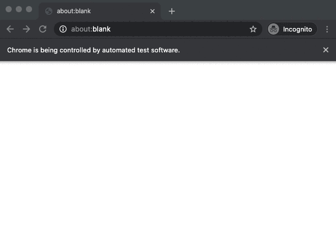

# Playwright Fluent API

- Chainable Methods

  - [withBrowser(browser)](#withBrowserbrowser)
  - [withOptions(options)](#withOptionsoptions)
  - [withDefaultWaitOptions(options)](#withDefaultWaitOptionsoptions)
  - [withDefaultAssertOptions(options)](#withDefaultAssertOptionsoptions)
  - [withWindowSize(size[, options])](#withWindowSizesize-options)
  - [withViewport(viewport[, options])](#withViewportviewport-options)
  - [withCursor()](#withCursor)
  - [withGeolocation(location)](#withGeolocationlocation)
  - [withPermissions(permissions)](#withPermissionspermissions)
  - [withExtraHttpHeaders(headers)](#withExtraHttpHeadersheaders)
  - [withTimezone(timezoneId)](#withTimezonetimezoneId)
  - [withStorageState(state)](#withStorageStatestate)
  - [withMocks(mocks[, options])](#withMocksmocks-options)
  - [emulateDevice(deviceName)](#emulateDevicedeviceName)
  - [delayRequestsTo(url, durationInSeconds)](#delayRequestsTourl-durationInSeconds)
  - [onRequestTo(url[, options]).respondWith(response)](#onRequestTourl-optionsrespondWithresponse)
  - [onRequestTo(url).respondFromHar(harFiles[, options])](#onRequestTourlrespondFromHarharFiles-options)
  - [recordDownloadsTo(directory)](#recordDownloadsTodirectory)
  - [recordFailedRequests()](#recordFailedRequests)
  - [recordNetworkActivity(options)](#recordNetworkActivityoptions)
  - [recordPageErrors()](#recordPageErrors)
  - [recordRequestsTo(url[, ignorePredicate])](#recordRequestsTourl-ignorePredicate)
  - [recordVideo(options)](#recordVideooptions)
  - [navigateTo(url[, options])](#navigateTourl-options)
  - [check(selector[, options])](#checkselector-options)
  - [clearText([options])](#clearTextoptions)
  - [click(selector[, options])](#clickselector-options)
  - [doubleClick(selector[, options])](#doubleClickselector-options)
  - [holdDownKey(key)](#holdDownKeykey)
  - [hover(selector[, options])](#hoverselector-options)
  - [invokeMethod(methodName,selector[, options])](#invokeMethodmethodNameselector-options)
  - [pasteText(text[, options])](#pasteTexttext-options)
  - [pause()](#pause)
  - [pressKey(key[, options])](#pressKeykey-options)
  - [releaseKey(key)](#releaseKeykey)
  - [runStory(story)](#runStorystory)
  - [select(labels).in(selector[, options])](#selectlabelsinselector-options)
  - [select(labels).inFocused([options])](#selectlabelsinfocusedoptions)
  - [selectByValue(values).in(selector[, options])](#selectByValuevaluesinselector-options)
  - [selectByValue(values).inFocused([options])](#selectByValuevaluesinfocusedoptions)
  - [switchToIframe(selector[, options])](#switchToIframeselector-options)
  - [switchToPreviousTab()](#switchToPreviousTab)
  - [typeText(text[, options])](#typeTexttext-options)
  - [uncheck(selector[, options])](#uncheckselector-options)
  - [wait(duration)](#waitduration)
  - [waitForStabilityOf(func[, waitOptions])](#waitForStabilityOffunc-waitOptions)
  - [waitUntil(predicate[, waitOptions, errorMessage])](#waitUntilpredicate-waitOptions-errorMessage)
  - [close([options])](#closeoptions)
  - [see also all chainable methods exposed by the Assertion API](./assertion.api.md)

- Helper Methods

  - [cast(unknown)](#castunknown)
  - [clearPageErrors()](#clearPageErrors)
  - [currentBrowser()](#currentBrowser)
  - [currentPage()](#currentPage)
  - [currentStorageState()](#currentStorageState)
  - [getAllOptionsOf(selector[, options])](#getAllOptionsOfselector-options)
  - [getSelectedOptionOf(selector[, options])](#getSelectedOptionOfselector-options)
  - [getAllSelectedOptionsOf(selector[, options])](#getAllSelectedOptionsOfselector-options)
  - [getSelectedText()](#getSelectedText)
  - [getCurrentUrl()](#getCurrentUrl)
  - [getCurrentWindowState()](#getCurrentWindowState)
  - [getPageErrors()](#getPageErrors)
  - [getToday(format)](#getTodayformat)
  - [getValueOf(selector[, options])](#getValueOfselector-options)
  - [hasBeenRedirectedToAnotherTab()](#hasBeenRedirectedToAnotherTab)
  - [hasFocus(selector[, options])](#hasFocusselector-options)
  - [isChecked(selector[, options])](#isCheckedselector-options)
  - [isUnchecked(selector[, options])](#isUncheckedselector-options)
  - [isDisabled(selector[, options])](#isDisabledselector-options)
  - [isEnabled(selector[, options])](#isEnabledselector-options)
  - [isVisible(selector[, options])](#isVisibleselector-options)
  - [saveStorageStateToFile(file)](#saveStorageStateToFilefile)
  - [takeFullPageScreenshotAsBase64([options])](#takeFullPageScreenshotAsBase64options)

## Chainable Methods

### withBrowser(browser)

- browser : `BrowserName`

```js
BrowserName = 'chrome' | 'chromium' | 'firefox' | 'webkit';
```

Will launch a browser together with a new page by using all `playwright` default settings and options.

If you choose 'chrome' you must have an already installed Chrome.
BEWARE: Playwright is only guaranteed to work with the bundled Chromium, Firefox or WebKit, use at your own risk.

Example:

```js
const browser = 'chromium';
const p = new PlaywrightFluent();
await p.withBrowser(browser);

// now if you want to use the playwright API from this point:
const browser = p.currentBrowser();
const page = p.currentPage();

// the browser and page objects are standard playwright objects
// so now you are ready to go by using the playwright API
```

---

### withOptions(options)

- options : `LaunchOptions`

```js
interface LaunchOptions {
  /**
   * Whether to run browser in headless mode.
   * Defaults to true
   *
   * @type {boolean}
   * @memberof LaunchOptions
   */
  headless: boolean;

  /**
   * Additional arguments to pass to the browser instance.
   * The list of Chromium flags can be found at
   * https://peter.sh/experiments/chromium-command-line-switches/
   *
   * @type {string[]}
   * @memberof LaunchOptions
   */
  args?: string[];

  /**
   * Path to a browser executable to run instead of the bundled one.
   *
   * @type {string}
   * @memberof LaunchOptions
   */
  executablePath?: string;
}
```

Will set browser options to apply when launching the browser.

Example:

```js
const browser = 'chromium';
const p = new PlaywrightFluent();

// start the browser in headfull mode
await p.withBrowser(browser).withOptions({ headless: false });
```

---

### withDefaultWaitOptions(options)

- options : `Partial<WaitOptions>`

```js
interface WaitOptions {
  /**
   * Defaults to 30000 milliseconds.
   *
   * @type {number}
   * @memberof WaitOptions
   */
  timeoutInMilliseconds: number;
  /**
   * Time during which the callback must always return true.
   * Defaults to 300 milliseconds.
   * You must not setup a duration < 100 milliseconds.
   * @type {number}
   * @memberof WaitOptions
   */
  stabilityInMilliseconds: number;
}
```

Will set the wait options to be applied on all browser actions (click, hoover, ...).

Use this method if you want to speed up test execution (but some flakiness may appear).
This default settings does not apply to assertions.

Example:

```js
const browser = 'chromium';
const p = new PlaywrightFluent();

// start the browser in headfull mode
await p
  .withBrowser(browser)
  .withOptions({ headless: false })
  .withDefaultWaitOptions({ stabilityInMilliseconds: 0, timeoutInMilliseconds: 10000 });
```

---

### withDefaultAssertOptions(options)

- options : `Partial<AssertOptions>`

```js
interface AssertOptions {
  /**
   * Defaults to 30000 milliseconds.
   *
   * @type {number}
   * @memberof AssertOptions
   */
  timeoutInMilliseconds: number;
  /**
   * time during which the Assert must give back the same result.
   * Defaults to 300 milliseconds.
   * You should not setup a duration < 100 milliseconds.
   * @type {number}
   * @memberof AssertOptions
   */
  stabilityInMilliseconds: number;
  /**
   * Will generate 'debug' logs,
   * so that you can understand why the assertion does not give the expected result.
   * Defaults to false
   * @type {boolean}
   * @memberof AssertOptions
   */
  verbose: boolean;
}
```

Will set the options to be applied on all assertions (expectThat...).

Use this method if you want to speed up test execution (but some flakiness may appear).

Example:

```js
const browser = 'chromium';
const p = new PlaywrightFluent();

// start the browser in headfull mode
await p
  .withBrowser(browser)
  .withOptions({ headless: false })
  .withDefaultAssertOptions({ stabilityInMilliseconds: 100, timeoutInMilliseconds: 10000 });
```

---

### withCursor()

Will show the mouse position with a non intrusive cursor.

Example:

```js
const browser = 'chromium';
const url = 'https://reactstrap.github.io/components/form';
const p = new PlaywrightFluent();

await p.withBrowser(browser).withOptions({ headless: false }).withCursor().navigateTo(url);
```


---

### withWindowSize(size[, options])

- size : `WindowSize`
- options: `Partial<WindowSizeOptions>`

Will set the browser window size to the specified `size`. Works only with Chrome and Firefox.

```js
interface WindowSize {
  width: number;
  height: number;
}

interface WindowSizeOptions {
  ciOnly: boolean;
}
```

If you want this setting to apply only in a CI, set `ciOnly: true` in the options parameter.

Example:

```js
const browser = 'chromium';
const options: LaunchOptions = {
  headless: false,
};
const url = 'https://reactstrap.github.io/components/form';

// prettier-ignore
await p
  .withBrowser(browser)
  .withOptions(options)
  .withWindowSize(sizeOf._1600x900)
  .navigateTo(url);
```

---

### withViewport(viewport[, options])

- viewport : `Viewport`
- options: `Partial<ViewportOptions>`

Will set the viewport size to the specified `viewport`.

```js
interface Viewport {
  width: number;
  height: number;
  deviceScaleFactor?: number;
  isMobile?: boolean;
}

interface ViewportOptions {
  ciOnly: boolean;
}
```

If you want this setting to apply only in a CI, set `ciOnly: true` in the options parameter.

Example:

```js
const browser = 'chromium';
const options: LaunchOptions = {
  headless: false,
};
const url = 'https://reactstrap.github.io/components/form';

// prettier-ignore
await p
  .withBrowser(browser)
  .withOptions(options)
  .withViewport({...sizeOf._1920x1440}, {ciOnly: true})
  .navigateTo(url);
```

---

### withExtraHttpHeaders(headers)

- headers: `HttpHeaders`

Will add specified HTTP headers for each request.

Example:

```js
const browser = 'chromium';
const url = 'https://reactstrap.github.io';

await p
  .withBrowser(browser)
  .withOptions({ headless: false })
  .withExtraHttpHeaders({ 'X-FOO': 'false', 'X-BAR': 'true' })
  .navigateTo(url);
```

---

### withPermissions(permissions)

- permissions: `...Permission[]`

Will set permissions.

```js
type Permission =
  | '*'
  | 'geolocation'
  | 'midi'
  | 'midi-sysex'
  | 'notifications'
  | 'push'
  | 'camera'
  | 'microphone'
  | 'background-sync'
  | 'ambient-light-sensor'
  | 'accelerometer'
  | 'gyroscope'
  | 'magnetometer'
  | 'accessibility-events'
  | 'clipboard-read'
  | 'clipboard-write'
  | 'payment-handler';
```

Example:

```js
const browser = 'chromium';
const p = new PlaywrightFluent();

await p
  .withBrowser(browser)
  .withOptions({ headless: false })
  .withGeolocation({ longitude: 12.492507, latitude: 41.889938 })
  .withPermissions('geolocation')
  .navigateTo('https://www.openstreetmap.org/')
  .click('.control-locate');
```

---

### withTimezone(timezoneId)

- timezoneId: `TimezeoneId`

Will set the timezone.

Example:

```js
const browser = 'chromium';
const p = new PlaywrightFluent();

// prettier-ignore
await p
  .withBrowser(browser)
  .withTimezone('Asia/Tokyo')
  .navigateTo('example.com');
```

---

### withGeolocation(location)

- location: `GeoLocation`

Will set Geo Location to the specified `location` data.

```js
interface Geolocation {
  longitude: number;
  latitude: number;
  accuracy?: number;
}
```

Example:

```js
const browser = 'chromium';
const p = new PlaywrightFluent();

await p
  .withBrowser(browser)
  .withOptions({ headless: false })
  .withGeolocation({ longitude: 12.492507, latitude: 41.889938 })
  .withPermissions('geolocation')
  .navigateTo('https://www.openstreetmap.org/')
  .click('.control-locate');
```

---

### withMocks(mocks[, options])

- mocks: `Partial<FluentMock>[]`
- options: `Partial<WithMocksOptions>`

Provide a set of mocks in order to automatically handle request interceptions.
!!! only for beta testers !!!

## You can call `withMocks` multiple times with different set of mocks. In this case, all mocks are agregated in an internal array and are all registered only once to request interception from `playwright`

### withStorageState(state)

(use only with Playwright >= v1.7.0)

- state: `string | StorageState`

Will re-hydrate cookies and localStorage values with the ones defined in `state`.

`state` is either a path to the file with saved storage, or an object with the following fields:

```js
export type StorageState = {
  /**
   * Optional cookies to set for context
   */
  cookies?: Array<{
    /**
     * **required**
     */
    name: string,

    /**
     * **required**
     */
    value: string,

    /**
     * Optional either url or domain / path are required
     */
    url?: string,

    /**
     * Optional either url or domain / path are required
     */
    domain?: string,

    /**
     * Optional either url or domain / path are required
     */
    path?: string,

    /**
     * Optional Unix time in seconds.
     */
    expires?: number,

    /**
     * Optional httpOnly flag
     */
    httpOnly?: boolean,

    /**
     * Optional secure flag
     */
    secure?: boolean,

    /**
     * Optional sameSite flag
     */
    sameSite?: 'Lax' | 'None' | 'Strict',
  }>,

  /**
   * Optional localStorage to set for context
   */
  origins?: Array<{
    origin: string,

    localStorage: Array<{
      name: string,

      value: string,
    }>,
  }>,
};
```

This method can be used to initialize context with logged-in information obtained via `saveStorageStateToFile(file)` or via `currentStorageState()` methods available on the PlaywrightFluent instance.

Example:

```js
const browser = 'chromium';
const p = new PlaywrightFluent();
const storageStateFile = join(__dirname, 'storage-state.json');

// prettier-ignore
await p
  .withBrowser(browser)
  .withStorageState(storageStateFile)
  .navigateTo('example.com');
```

---

### emulateDevice(deviceName)

- deviceName: `DeviceName`
  - see the [list of supported devices](/src/devices/device-names.ts)

Will emulate the selected device, and the browser window size and viewport will match the selected device.

Example:

```js
const browser = 'chromium';
const url = 'https://reactstrap.github.io/components/form';
const p = new PlaywrightFluent();

// start the browser in headfull mode
// and emulate an iPhone 6 in landscape mode
await p
  .withBrowser(browser)
  .withOptions({ headless: false })
  .emulateDevice('iPhone 6 landscape')
  .navigateTo(url);
```

---

### recordPageErrors()

Will track and record page errors (uncaught exceptions and console.error logs).

- use `getPageErrors()` helper method on the fluent API to access errors that have occurred.
- use `clearPageErrors()` helper method on the fluent API to clear all past errors.

Example:

```js
const browser = 'chromium';
const url = 'https://reactstrap.github.io/components/form';
const p = new PlaywrightFluent();

// start the browser in headfull mode
// and emulate an iPhone 6 in landscape mode
await p
  .withBrowser(browser)
  .withOptions({ headless: false })
  .emulateDevice('iPhone 6 landscape')
  .recordPageErrors()
  .navigateTo(url)
  ...;

```

---

### recordFailedRequests()

Will track and record failed requests.

- use `getFailedRequests()` helper method on the fluent API to access errors that have occurred.
- use `clearFailedRequests()` helper method on the fluent API to clear all past errors.

Example:

```js
const browser = 'chromium';
const url = 'https://reactstrap.github.io/components/form';
const p = new PlaywrightFluent();

// start the browser in headfull mode
// and emulate an iPhone 6 in landscape mode
await p
  .withBrowser(browser)
  .withOptions({ headless: false })
  .emulateDevice('iPhone 6 landscape')
  .recordFailedRequests()
  .navigateTo(url);
```

The `playwright-fluent` package exposes the helper functions `stringifyRequest(request)` and `toRequestInfo(request)` that you can use to convert the `playwright` request object to a JSON object (see the example below).

```js
import { stringifyRequest } from 'playwright-fluent';

const failedRequests = p.getFailedRequests();
for (let index = 0; index < failedRequests.length; index++) {
  const failedRequest = failedRequests[index];
  const stringifiedRequest = await stringifyRequest(failedRequest);
  console.log(stringifiedRequest);
}
```

---

### recordNetworkActivity(options)

- options: `HarOptions`

```js
export interface HarOptions {
  /**
   * Optional setting to control whether to omit request content from the HAR. Defaults to `false`.
   */
  omitContent?: boolean;

  /**
   * Path on the filesystem to write the HAR file to.
   */
  path: string;
}
```

Enables HAR recording for all pages. Network activity will be saved into options.path file. If not specified, the HAR is not recorded. Make sure to close the browser for the HAR to be saved.

Example:

```js
const browser = 'chromium';
const url = 'https://reactstrap.github.io/components/form';
const p = new PlaywrightFluent();
const harFilepath = `${path.join(__dirname, uniqueFilename({ prefix: 'har-', extension: '.json' }))}`;

// start the browser in headfull mode
// and emulate an iPhone 6 in landscape mode
await p
  .withBrowser(browser)
  .withOptions({ headless: false })
  .emulateDevice('iPhone 6 landscape')
  .recordNetworkActivity({ path: harFilepath })
  .navigateTo(url)
  ...
  .close();

const harData = p.getRecordedNetworkActivity();

```

- use `getRecordedNetworkActivity()` helper method on the fluent API to access the HAR data as a json object.

---

### delayRequestsTo(url, durationInSeconds)

- url: `string`
- durationInSeconds: `number`

Delay requests whose url contains the input url. This `url` parameter should be seen as a partial url (it is not a regex and not a glob pattern).

Usefull when you need to check how the front behaves when a request is pending during a specific amount of time. This will enable you to test how the front handle internal timeouts and how loading hints are displayed.

---

### recordVideo(options)

- options: `RecordVideoOptions`

```js
export interface RecordVideoOptions {
  dir: string;
  size?: {
    width: number,
    height: number,
  };
}
```

Enables video recording into the `options.dir` directory.
If not specified videos are not recorded.
Make sure to await browserContext.close() for videos to be saved.

Example:

```js
const p = new PlaywrightFluent();
await p
  .withBrowser('chromium')
  .withOptions({ headless: true })
  .withWindowSize(sizeOf._1024x768)
  .clearVideoFilesOlderThan(__dirname, 60)
  .recordVideo({ dir: __dirname, size: sizeOf._1024x768 })
  .navigateTo(url)
  ...
  .close();

const videoPath = await p.getRecordedVideoPath();

```

- use `clearVideoFilesOlderThan()` helper method on the fluent API to delete old videos.

---

### recordDownloadsTo(directory)

- directory: `string`

Will save all downloads to the specified `directory`.

Example:

```js
const expectedDownloadedFilepath = path.join(userDownloadsDirectory, 'download.zip');
deleteFile(expectedDownloadedFilepath);

await p
  .withBrowser('chromium')
  .withOptions({ headless: true })
  .withCursor()
  .recordDownloadsTo(userDownloadsDirectory)
  .navigateTo(url)
  .click('a#download-package')
  .waitUntil(async () => fileExists(expectedDownloadedFilepath));
```

---

### recordRequestsTo(url[, ignorePredicate])

- url: `string`
- ignorePredicate: `(request: PlaywrightRequest) => boolean`

Will track and record requests whose url contains the input url. This parameter should be seen as a partial url (it is not a regex and not a glob pattern).

Use the optional `ignorePredicate` predicate to ignore specific requests.

Usefull when you need to check what the front sends to the back and/or what the back sends to the front. Each recorded request is a standard `playwright` request object that contains both the request and the response.

The `playwright-fluent` package exposes the helper functions `stringifyRequest(request)` and `toRequestInfo(request)` that you can use to convert the `playwright` request object to a JSON object (see the example below).

Example:

```js
const browser = 'chromium';
const url = 'https://reactstrap.github.io/components/form';
const p = new PlaywrightFluent();

// start the browser in headfull mode
// and emulate an iPhone 6 in landscape mode
await p
  .withBrowser(browser)
  .withOptions({ headless: false })
  .emulateDevice('iPhone 6 landscape')
  .recordRequestsTo('/foo') // will record any requests whose url includes '/foo'
  .recordRequestsTo('/bar') // will also record any requests whose url includes '/bar'
  .navigateTo(url);
```

- use `getRecordedRequestsTo(url)` helper method on the fluent API to access all requests that have occurred with this `url`.

- use `getLastRecordedRequestTo(url)` helper method on the fluent API to access the last request that has occurred with this `url`.

- use `clearRecordedRequestsTo(url)` helper method on the fluent API to clear all past requests with this `url`.

- use `stringifyRequest(request)` method exposed by the package to either log the recorded requests

  ```js
  console.log(await stringifyRequest(request));
  ```

- use `toRequestInfo(request)` method exposed by the package to convert the recorded request to a POJO object:

  ```js
  const requestInfo = await toRequestInfo(request);
  ```

---

### onRequestTo(url[, options]).respondWith(response)

- url: `string`
- options: `Partial<RequestInterceptionFilterOptions>`
- response: `Partial<MockResponse<T> | ((request: Request) => Partial<MockResponse<T>>)`
- bypassPredicate: `(request: PlaywrightRequest) => boolean`

Will intercept any request whose url contains the input `url` (this parameter should be seen as a partial url, it is not a regex and not a glob pattern), then will respond with the given `response` object.

You can bypass the interception by setting up the optional `bypassPredicate` parameter in the options object.

By default, all verbs for the same request `url` are intercepted. If you want to intercept only specific verb for the given `url`, you should setup the `method` in the options object.

The main purpose of this feature, is to be able to intercept rest API calls, that gives back a JSON object of type `T`, and then substitute the response by another JSON object of type `T`, or substitute the HTTP response status by another one (for example subsitute an HTTP 200 by an HTTP 500, for chaos testing).

Be careful to call the `onRequestTo(url).respondWith(response)` before navigating to the first page of the web site under test.

```js
interface MockResponse<T> {
  status: number;
  headers: HttpHeaders;
  contentType: string;
  body: T;
}
```

```js
interface RequestInterceptionFilterOptions {
  /**
   * Intercepts only requests with the given method (GET, POST, ...).
   * By default all requests to the given url are intercepted for every HTTP verbs
   *
   * @type {HttpRequestMethod}
   * @memberof RequestInterceptionFilterOptions
   */
  method?: HttpRequestMethod;
  /**
   * Predicate that will enable you to bypass request interception on custom conditions
   *
   * @memberof RequestInterceptionFilterOptions
   */
  bypassPredicate?: (request: Request) => boolean;
}
```

Example:

```js
const browser = 'chromium';
const url = 'https://reactstrap.github.io/components/form';
const p = new PlaywrightFluent();

const mockResponseBody {
  prop1: 'mocked-prop1',
  prop2: 'mocked-prop2'
};
const responseHeaders = {'foo-header': 'bar' };

// start the browser in headfull mode
// and emulate an iPhone 6 in landscape mode
await p
  .withBrowser(browser)
  .withOptions({ headless: false })
  .emulateDevice('iPhone 6 landscape')
  .onRequestTo('/api/foobar', {method: 'POST'})
  .respondWith({
    status: 200,
    headers: responseHeaders,
    body: mockResponseBody,
  })
  .navigateTo(url);

```

if the `response` object depends on the `request` object, you may use the functional version of this method:

```js
await p
  .withBrowser(browser)
  .withOptions({ headless: false })
  .emulateDevice('iPhone 6 landscape')
  .onRequestTo('/api/foobar', , {method: 'GET'})
  .respondWith((request) => {
    const url = request.url();
    if (url.includes('?foo=bar')) {
      return {
        status: 200,
        headers: responseHeaders,
        body: mockResponseBody,
      };
    }
    throw new Error(`Cannot handle to request '${url}'`);
  })
  .navigateTo(url);
```

For chaos testing:

```js
const browser = 'chromium';
const url = 'https://reactstrap.github.io/components/form';
const p = new PlaywrightFluent();

// start the browser in headfull mode
// and emulate an iPhone 6 in landscape mode
await p
  .withBrowser(browser)
  .withOptions({ headless: false })
  .emulateDevice('iPhone 6 landscape')
  .onRequestTo('/api/foobar')
  .respondWith({
    status: 401,
    body: 'sorry, you have no access',
  })
  .navigateTo(url);
```

You can also build dynamically a mock response by looking the corresponding request/response in a locally stored HAR file :

```js
const harFile = path.join(__dirname, 'my.har');
const harData = getHarDataFrom(harFile);

await p
  .withBrowser(browser)
  .withOptions({ headless: false })
  .emulateDevice('iPhone 6 landscape')
  // .recordNetworkActivity({ path: harFile }) // uncomment to generate the HAR file
  .onRequestTo('/api/foobar', { method: 'POST' })
  .respondWith((request) => {
    const harResponse = getHarResponseFor(request, harData);
    // prettier-ignore
    const response = getHarResponseContentAs<CustomResponseBody>(harResponse);
    // at this point you can modify the response that will be sent back to the browser
    return {
      status: harResponse?.status,
      headers: harHeadersToHttpHeaders(harResponse?.headers),
      body: response,
    };
  })
  .navigateTo(url);
```

---

### onRequestTo(url).respondFromHar(harFiles[, options])

- url: `string`
- harFiles: `string[]`
- options: `Partial<HarRequestResponseOptions>`

Will intercept any request whose url contains the input `url` (this parameter should be seen as a partial url, it is not a regex and not a glob pattern), then will automatically respond with a `response` object that match input request inside HAR files.

This feature is experimental and might not work as you expect!
The main purpose of this feature, is to be able to run and test a website in complete isolation from the backend (HTTP requests only).

Be careful to call the `onRequestTo(url).respondFromHar()` before navigating to the first page of the website under test.

The options object enables you to override some or all of the internal implementation.

```js
export interface HarRequestResponseOptions {
  /**
   * Optional filter to take only a subset of all available HAR entries
   * By default all HAR entries found in the provided HAR files are taken
   * @memberof HarRequestResponseOptions
   */
  filterAllHarEntriesBeforeProcessing: (entry: HarEntry, index: number) => boolean;

  /**
   * Optional Predicate used to bypass request interception for specific requests.
   * By default all requests that match the given url are intercepted.
   * @memberof HarRequestResponseOptions
   */
  bypassRequestPredicate: (request: Request) => boolean;

  /**
   * Optional filter that enables you to select the HAR entries for the given requested Url
   * By default entries are filtered by comparing the urls without the hostname and without the query string
   * @memberof HarRequestResponseOptions
   */
  filterHarEntryByUrl: (requestUrl: string, harRequestUrl: string, index: number) => boolean;

  /**
   * Optional filter that enables you to select the HAR entries for the given requested postdata
   * By default entries are filtered by checking equality of postdata
   * @memberof HarRequestResponseOptions
   */
  filterHarEntryByPostData: (
    requestPostData: string | null,
    harRequestPostData: HarPostData,
    index: number,
  ) => boolean;

  /**
   * Optional filter that enables you to select the HAR entries for the given requested url and query string
   *
   * @memberof HarRequestResponseOptions
   */
  filterHarEntryByQueryString: (
    requestUrl: string,
    harRequestUrl: string,
    index: number,
  ) => boolean;

  /**
   * Optional filter that enables you to select the HAR entries with a specific response status
   *
   * @memberof HarRequestResponseOptions
   */
  filterHarEntryByResponseStatus: (status: number) => boolean;

  /**
   * Optional selector to let you select one HAR entry when several HAR entries have been found.
   * By default the last HAR entry is taken.
   *
   * @memberof HarRequestResponseOptions
   */
  selectEntryFromFoundHarEntries: (entries: HarEntry[], requestedUrl: string) => HarEntry;

  /**
   * Optional callback that will enable you to diagnose why no HAR entry has been found regarding a specific request url.
   * You should not mutate any given parameters
   *
   * @memberof HarRequestResponseOptions
   */
  onHarEntryNotFound: (
    allEntries: HarEntry[],
    requestedUrl: string,
    requestedMethod: HttpRequestMethod,
  ) => void;

  /**
   * Optional callback that will enable you to check the correct HAR entry has been selected regarding a specific request url.
   * You should not mutate any given parameters
   *
   * @memberof HarRequestResponseOptions
   */
  onHarEntryFound: (
    foundEntry: HarEntry,
    requestedUrl: string,
    requestedMethod: HttpRequestMethod,
  ) => void;

  /**
   * Optional callback that will enable you to add/remove/update the headers that will be provided in the response object
   * By default all headers found in the HAR entry will be used to serve the response.
   *
   * @memberof HarRequestResponseOptions
   */
  enrichResponseHeaders: (headers: HttpHeaders) => HttpHeaders;

  /**
   * Optional callback that will enable you to handle yourself the request interception
   * in case the internal implementation did not found any entry in the provided HAR files.
   * By default route.continue() will be called.
   *
   * @memberof HarRequestResponseOptions
   */
  handleRouteOnHarEntryNotFound: (route: Route, request: Request, entries: HarEntry[]) => void;

  /**
   * Optional callback that enables you to provide yourself an HAR entry for the given requested
   * when the internal implementation did not found any entry.
   *
   * @memberof HarRequestResponseOptions
   */
  provideEntryOnHarEntryNotFound: (request: Request, entries: HarEntry[]) => HarEntry | null;
}
```

Example:

```js
const p = new PlaywrightFluent();
const harFile = path.join(__dirname, 'github.com.har');

await p
  .withBrowser('chromium')
  .withOptions({ headless: false })
  .withCursor()
  .onRequestTo('/')
  .respondFromHar([harFile])
  .navigateTo('https://github.com/');

// The github website should open with the full UI even if the network is offine.
```

---

### navigateTo(url[, options])

- url: `string`
- options: `NavigationOptions`

```js
interface NavigationOptions {
  /**
   * Maximum navigation time in milliseconds,
   * defaults to 30 seconds,
   * pass 0 to disable timeout
   *
   * @type {number}
   * @memberof NavigationOptions
   */
  timeout: number;
}
```

Will navigate to the specified url.

Example:

```js
const browser = 'chromium';
const url = 'https://reactstrap.github.io/components/form';
const p = new PlaywrightFluent();

// prettier-ignore
await p
  .withBrowser(browser)
  .navigateTo(url);

// now if you want to use the playwright API from this point:
const browser = p.currentBrowser();
const page = p.currentPage();

// the browser and page objects are standard playwright objects
// so now you are ready to go by using the playwright API
```

---

### pause()

(use only with Playwright >= v1.9.0)

Pauses script execution. Playwright will stop executing the script and wait for the user to either press 'Resume' button in the page overlay or to call playwright.resume() in the DevTools console.

User can inspect selectors or perform manual steps while paused. Resume will continue running the original script from the place it was paused.

`pause` will be ignored when executed on CI or when the browser is headless.

Example:

```js
const browser = 'chromium';
const url = 'https://reactstrap.github.io/components/form';
const selector = '#exampleCustomRange';
const p = new PlaywrightFluent();

await p
  .withBrowser(browser)
  .withOptions({ headless: false })
  .withCursor()
  .navigateTo(url)
  .pause()
  .hover(selector);
```

---

### hover(selector[, options])

- selector: `string | SelectorFluent`
- options: `Partial<HoverOptions>`

```js
interface HoverOptions {
  timeoutInMilliseconds: number;
  stabilityInMilliseconds: number;
  steps: number;
  verbose: boolean;
}
```

Will hover on the specified selector. The selector can be either a CSS selector or Selector Object created by the [Selector API](/docs/selector.api.md).

Example:

```js
const browser = 'chromium';
const url = 'https://reactstrap.github.io/components/form';
const selector = '#exampleCustomRange';
const p = new PlaywrightFluent();

await p
  .withBrowser(browser)
  .withOptions({ headless: false })
  .withCursor()
  .navigateTo(url)
  .hover(selector);

// now if you want to use the playwright API from this point:
const browser = p.currentBrowser();
const page = p.currentPage();

// the browser and page objects are standard playwright objects
// so now you are ready to go by using the playwright API
```

Example with a Selector Object:

```js
const browser = 'chromium';
const url = 'https://reactstrap.github.io/components/form';
const p = new PlaywrightFluent();
const selector = p.selector('label').withText('Email').nth(3);

await p
  .withBrowser(browser)
  .withOptions({ headless: false })
  .withCursor()
  .navigateTo(url)
  .hover(selector);

// now if you want to use the playwright API from this point:
const browser = p.currentBrowser();
const page = p.currentPage();

// the browser and page objects are standard playwright objects
// so now you are ready to go by using the playwright API
```

---

### invokeMethod(methodName,selector[, options])

- methodName: `click | focus | blur | select`
- selector: `string | SelectorFluent`
- options: `Partial<InvokeOptions>`

```js
interface InvokeOptions {
  stabilityInMilliseconds: number;
  timeoutInMilliseconds: number;
  verbose: boolean;
}
```

Be able to invoke a native method on a selector.
Use this action only in edge cases where the selector itself is hidden because of its transprency, or because it has null dimension, and the normal click does not work neither on this selector nor on it's parent.

This method automatically (and only ) waits for the selector to exist in the DOM.

Example:

```js
const url = 'https://reactstrap.github.io/components/form';
const checkMeOut = p.selector('label').withText('Check me out').find('input');

// When
await p
  .withBrowser('chromium')
  .withOptions({ headless: false })
  .withCursor()
  .emulateDevice('iPhone 6 landscape')
  .navigateTo(url)
  .expectThat(checkMeOut)
  .isEnabled()
  .invokeMethod('click', selector);
```

---

### check(selector[, options])

- selector: `string | SelectorFluent`
- options: `Partial<CheckOptions>`

```js
interface CheckOptions {
  stabilityInMilliseconds: number;
  timeoutInMilliseconds: number;
  verbose: boolean;
}
```

Will check the specified selector. The selector can be either a CSS selector or Selector Object created by the [Selector API](/docs/selector.api.md).

This method automatically waits for the selector to be visible, then hovers over it, then waits until it is enabled and finally check it, if not already checked.

Example:

```js
const url = 'https://reactstrap.github.io/components/form';
const checkMeOut = p.selector('label').withText('Check me out').find('input');

// When
await p
  .withBrowser('chromium')
  .withOptions({ headless: false })
  .withCursor()
  .emulateDevice('iPhone 6 landscape')
  .navigateTo(url)
  .check(checkMeOut)
  .expectThatSelector(checkMeOut)
  .isChecked();

// now if you want to use the playwright API from this point:
const browser = p.currentBrowser();
const page = p.currentPage();

// the browser and page objects are standard playwright objects
// so now you are ready to go by using the playwright API
```

---

### uncheck(selector[, options])

- selector: `string | SelectorFluent`
- options: `Partial<CheckOptions>`

```js
interface CheckOptions {
  stabilityInMilliseconds: number;
  timeoutInMilliseconds: number;
  verbose: boolean;
}
```

Will uncheck the specified selector. The selector can be either a CSS selector or Selector Object created by the [Selector API](/docs/selector.api.md).

This method automatically waits for the selector to be visible, then hovers over it, then waits until it is enabled and finally uncheck it, if not already unchecked.

Example:

```js
const url = 'https://reactstrap.github.io/components/form';
const checkMeOut = p.selector('label').withText('Check me out').find('input');

// When
await p
  .withBrowser('chromium')
  .withOptions({ headless: false })
  .withCursor()
  .emulateDevice('iPhone 6 landscape')
  .navigateTo(url)
  .uncheck(checkMeOut);

// now if you want to use the playwright API from this point:
const browser = p.currentBrowser();
const page = p.currentPage();

// the browser and page objects are standard playwright objects
// so now you are ready to go by using the playwright API
```

---

### switchToIframe(selector[, options])

- selector: `string | SelectorFluent`
- options: `Partial<SwitchToIframeOptions>`

```js
export interface SwitchToIframeOptions extends HoverOptions {
  injectCursor: boolean;
}
```

Will switch inside the iframe targeted by the specified selector.

Example:

```js
const p = new PlaywrightFluent();
const selector = 'iframe';
const inputInIframe = '#input-inside-iframe';
const inputInMainPage = '#input-in-main-page';
await p
  .withBrowser('chromium')
  .withOptions({ headless: false })
  .withCursor()
  .navigateTo(url)
  .hover(selector)
  .switchToIframe(selector)
  .click(inputInIframe)
  .typeText('hey I am in the iframe')
  .switchBackToPage()
  .click(inputInMainPage)
  .typeText('hey I am back in the page!');
```

Once you have switched to an iframe, you must call `switchBackToPage()` to switch back to the current page.

---

### click(selector[, options])

- selector: `string | SelectorFluent`
- options: `Partial<ClickOptions>`

```js
interface ClickOptions {
  button: 'left' | 'right' | 'middle';
  clickCount: number;
  delay: number;
  modifiers?: Modifier[];
  position?: Point;
  stabilityInMilliseconds: number;
  timeoutInMilliseconds: number;
  verbose: boolean;
}

type Modifier = 'Alt' | 'Control' | 'Meta' | 'Shift';
type Point = {
  x: number,
  y: number,
};
```

Will click on the specified selector. The selector can be either a CSS selector or Selector Object created by the [Selector API](/docs/selector.api.md).

This method automatically waits for the selector to be visible, then hovers over it, then waits until it is enabled and finally click on it.

Example:

```js
const url = 'https://reactstrap.github.io/components/form';
const checkMeOut = p.selector('label').withText('Check me out');

await p
  .withBrowser('chromium')
  .withOptions({ headless: false })
  .withCursor()
  .emulateDevice('iPhone 6 landscape')
  .navigateTo(url)
  .click(checkMeOut)
  .expectThat(checkMeOut.find('input'))
  .hasFocus();

// now if you want to use the playwright API from this point:
const browser = p.currentBrowser();
const page = p.currentPage();

// the browser and page objects are standard playwright objects
// so now you are ready to go by using the playwright API
```



---

### doubleClick(selector[, options])

- selector: `string | SelectorFluent`
- options: `Partial<DoubleClickOptions>`

```js
interface DoubleClickOptions {
  button: 'left' | 'right' | 'middle';
  delay: number;
  modifiers?: Modifier[];
  position?: Point;
  stabilityInMilliseconds: number;
  timeoutInMilliseconds: number;
  verbose: boolean;
}

type Modifier = 'Alt' | 'Control' | 'Meta' | 'Shift';
type Point = {
  x: number,
  y: number,
};
```

Will double-click on the specified selector. The selector can be either a CSS selector or Selector Object created by the [Selector API](/docs/selector.api.md).

This method automatically waits for the selector to be visible, then hovers over it, then waits until it is enabled and finally double-click on it.

Example:

```js
const url = 'https://reactstrap.github.io/components/form';
const label = p.selector('label').withText('Email');

await p
  .withBrowser('chromium')
  .withOptions({ headless: false })
  .withCursor()
  .emulateDevice('iPhone 6 landscape')
  .navigateTo(url)
  .doubleClick(label)
  .expectThatAsyncFunc(async () => await p.getSelectedText())
  .resolvesTo('Email');
```

---

### pressKey(key[, options])

- key: `'Tab' | 'Backspace' | 'Enter' | 'ArrowDown' | 'ArrowLeft' | 'ArrowRight' | 'ArrowUp' | 'KeyA' ... 'KeyZ'`
- options: `Partial<KeyboardPressOptions>`

```js
interface KeyboardPressOptions {
  /**
   * Time to wait between keydown and keyup in milliseconds.
   * Defaults to 50.
   *
   * @type {number}
   * @memberof KeyboardPressOptions
   */
  delay: number;
}
```

Will press the specified key.

---

### holdDownKey(key)

### releaseKey(key)

- key: `'Shift' | 'Control' | 'Alt'`

Will hold down and release the specified key.

Example:

```js
await p
  .click(selector)
  .holdDownKey('Shift')
  .pressKey('KeyA')
  .pressKey('KeyB')
  .releaseKey('Shift')
  .pressKey('KeyA');

// will generate ABa
```

---

### select(labels).in(selector[, options])

- labels : `...string[]`
- selector: `string | SelectorFluent`
- options: `Partial<SelectOptions>`

```js
interface SelectOptions {
  stabilityInMilliseconds: number;
  timeoutInMilliseconds: number;
  verbose: boolean;
}
```

Will select label(s) in the specified selector.

```html
<select id="select">
  <option value="value 1" selected>label 1</option>
  <option value="value 2">label 2</option>
  <option value="value 3">label 3</option>
</select>
```

```js
const selector = '#select';
await p.select('label 2').in(selector);
```

---

### selectByValue(values).in(selector[, options])

- values : `...string[]`
- selector: `string | SelectorFluent`
- options: `Partial<SelectOptions>`

```js
interface SelectOptions {
  stabilityInMilliseconds: number;
  timeoutInMilliseconds: number;
  verbose: boolean;
}
```

Will select label(s) by using their values in the specified selector.

```html
<select id="select">
  <option value="value 1" selected>label 1</option>
  <option value="value 2">label 2</option>
  <option value="value 3">label 3</option>
</select>
```

```js
const selector = '#select';
await p.selectByValue('value 2').in(selector);
```

---

### select(labels).inFocused([options])

- labels : `...string[]`
- options: `Partial<SelectOptions>`

```js
interface SelectOptions {
  stabilityInMilliseconds: number;
  timeoutInMilliseconds: number;
  verbose: boolean;
}
```

Will select label(s) in the select element that has current focus.

```html
<label for="select">Select something</label>
<select id="select">
  <option value="value 1" selected>label 1</option>
  <option value="value 2">label 2</option>
  <option value="value 3">label 3</option>
</select>
```

```js
// prettier-ignore
await p
  .click(p.selector('label').withText('Select something'))
  .select('label 2').inFocused();
```

---

### selectByValue(values).inFocused([options])

- values : `...string[]`
- options: `Partial<SelectOptions>`

```js
interface SelectOptions {
  stabilityInMilliseconds: number;
  timeoutInMilliseconds: number;
  verbose: boolean;
}
```

Will select values(s) in the select element that has current focus.

```html
<label for="select">Select something</label>
<select id="select">
  <option value="value 1" selected>label 1</option>
  <option value="value 2">label 2</option>
  <option value="value 3">label 3</option>
</select>
```

```js
// prettier-ignore
await p
  .click(p.selector('label').withText('Select something'))
  .selectByValue('value 2').inFocused();
```

---

### typeText(text[, options])

- text: `string`
- options: `Partial<TypeTextOptions>`

```js
interface TypeTextOptions {
  /**
   * Time to wait between key presses in milliseconds.
   * Defaults to 50
   *
   * @type {number}
   * @memberof TypeTextOptions
   */
  delay: number;
  /**
   * Clear existing text before typing.
   * Defaults to true
   *
   * @type {boolean}
   * @memberof TypeTextOptions
   */
  clearExistingTextBeforeTyping: boolean;
}
```

Will type text in the element that has current focus. This method will automtically empty any existing content before typing the specified text.

If you know that an input element is always empty, you might set the option `clearExistingTextBeforeTyping` to `false` in order to speed-up the input process.

---

### pasteText(text[, options])

- text: `string`
- options: `Partial<PasteTextOptions>`

```js
interface PasteTextOptions {
  /**
   * Time to wait between key presses in milliseconds.
   * Defaults to 50
   *
   * @type {number}
   * @memberof TypeTextOptions
   */
  delay: number;

  /**
   * Should be set to true when the underlying selector does not explicitely handle the paste event.
   * When sets to true, playwright-fluent automatically attaches a paste event handler on the focused selector.
   * Defaults to false.
   *
   * @type {boolean}
   * @memberof PasteTextOptions
   */
  handlePasteEvent: boolean;
  /**
   * Clear any existing content before pasting
   * Defaults to true
   *
   * @type {boolean}
   * @memberof PasteTextOptions
   */
  clearExistingContent: boolean;
}
```

Will paste text in the element that has current focus. This method will automatically empty any existing content before pasting the specified text. If you want to keep the existing content, set the `clearExistingContent` option to `true`.

---

### clearText([options])

- options: `Partial<ClearTextOptions>`

```js
interface ClearTextOptions {
  /**
   * Time to wait between key presses in milliseconds.
   * Defaults to 50
   *
   * @type {number}
   * @memberof ClearTextOptions
   */
  delay: number;
}
```

Will clear text in the element that has current focus.

example:

```js
await p
  .withBrowser('chromium')
  .withOptions({ headless: false })
  .withCursor()
  .navigateTo(url)
  .click(selector)
  .clearText();
```

---

### wait(duration)

- duration: `number`

  time to wait in milliseconds.

---

### waitUntil(predicate[, waitOptions, errorMessage])

- predicate: `() => Promise<boolean>`
- waitOptions: `Partial<WaitUntilOptions>`
- errorMessage: `string | (() => Promise<string>)`

Will wait until predicate becomes true.
If the predicate does not return true during the specified period, an error will be throwed.

To prevent throwing, set `throwOnTimeout: false` in the `waitOptions`.

To generate a custom error message pass either a `string` or an async function `() => Promise<string>` that gives back a string.

Usage example:

```js
const selector = p
  .selector('[role="row"]')
  .find('td')
  .find('p');
  .withText('foobar');

await p.waitUntil(() => selector.isVisible());
```

---

### waitForStabilityOf(func[, waitOptions])

- func: `() => Promise<string | boolean | number | null | undefined>`
- waitOptions: `Partial<WaitUntilOptions>`

Waits until the function `func()` returns the same result during a specified period of time that defaults to 300 ms.

If the function `func()` does not return the same result during the specified period, an error will be throwed.
To prevent throwing, set `throwOnTimeout: false` in the `waitOptions`.

Usage example:

```js
const selector = p.selector('[role="row"]'); // will select all rows in a grid

await p.waitForStabilityOf(() => selector.count()); // waits until the number of rows is stable
```

---

### switchToPreviousTab()

Switch to the previous tab.

Use this method for example when a click on a link redirects test execution on a new tab but you want to continue your test in the original tab.

Example:

```js
import { PlaywrightFluent } from 'playwright-fluent';

const url = `some valid url`;
const p = new PlaywrightFluent();
const openLinkToNewTab = p.selector('a[target="_blank"]').withText('open reactstrap form')

await p
      // open tab 1
      .withBrowser('chromium')
      .withOptions({ headless: false })
      .withCursor()
      .emulateDevice('iPhone 6 landscape')
      .navigateTo(url)
      .click(openLinkToNewTab) // will switch to tab 2
      ... // continue test on tab 2
      .switchToPreviousTab() // return to tab 1
      ... // continue test on tab 1
      .switchToPreviousTab() // return to tab 2
      ... //etc
```

---

### runStory(story)

- story: `Story | StoryWithProps<T>`

```js
type Story = (p: PlaywrightFluent) => Promise<void>;
type StoryWithProps<T> = (p: PlaywrightFluent, props: T) => Promise<void>;
```

A `Story` is an async method you write that will receive, at runtime, the current instance of the `PlaywrightFluent`.

A `StoryWithProps<T>` is an async method you write, that will receive, at runtime, the current instance of the `PlaywrightFluent`, and a parameter of type `T` supplied by you in the `runStory` method.

Example:

```js
import { PlaywrightFluent } from 'playwright-fluent';
import { startApp } from '../stories/start-app';
import { selectLabel } from '../stories/select-label';

const url = `some valid url`;
const p = new PlaywrightFluent();

await p
  .runStory(startApp, { browser: 'chromium', isHeadless: false, url })
  .runStory(selectLabel, 'label 2');
```

../stories/start-app.js

```js
import { StoryWithProps } from 'playwright-fluent';

export interface StartAppProps {
  browser: BrowserName;
  isHeadless: boolean;
  url: string;
}

export const startApp: StoryWithProps<StartAppProps> = async (p, props) => {
  await p
    .withBrowser(props.browser)
    .withOptions({ headless: props.isHeadless })
    .withCursor()
    .navigateTo(props.url);
};
```

../stories/select-label.js

```js
import { StoryWithProps } from 'playwright-fluent';

export const selectLabel: StoryWithProps<string> = async (p, label) => {
  const selector = 'some valid css selector';
  await p.select(label).in(selector);
};
```

As shown in the above example, the goal of a `story` is to write a test as a composition of functional components (like in React).

**Warning**: the internal implementation of the `runStory` only handle simple use cases.

If you call `runStory` inside another `runStory` inside another `runStory` it might not work.

Two levels of imbrication should work, but three levels might not.

As a simple rule, if you observe that a story is not executed or is executed too late, you should break the chained `runStory` like this:

```js
// prettier-ignore
await p
  .runStory(storyA)
  .runStory(storyB);

// simply break the chained calls to make things work:
await p.runStory(storyA);
await p.runStory(storyB);
```

Example of code that do not work:

```js
const p = new PlaywrightFluent();
await p.runStory(mainStory);

const mainStory: Story = async (p) => {
  // prettier-ignore
  await p
    .runStory(storyA)
    .runStory(storyB);
};

const storyA: Story = async (p) => {
  // prettier-ignore
  await p
    .runStory(storyA1)
    .runStory(storyA2);
};

const storyB: Story = async (p) => {
  // prettier-ignore
  await p
    .runStory(storyB1)
    .runStory(storyB2);
};
```

In the above example `StoryB` will execute before `StoryA`.

To make things work:

```js
const mainStory: Story = async (p) => {
  // prettier-ignore
  await p
    .runStory(storyA)
    .runStory(storyB);
};
```

Should be rewritten to:

```js
const mainStory: Story = async (p) => {
  await p.runStory(storyA);
  await p.runStory(storyB);
};
```

---

### close(options)

- options: `Partial<CloseOptions>`

Will close the browser. This should be the last method called in the chain.

```js
interface CloseOptions {
  /**
   * Time out used to prevent too slow or buggy browser closing.
   * Defaults to 3000 milliseconds.
   *
   * @type {number}
   * @memberof CloseOptions
   */
  timeoutInMilliseconds: number;
}
```

The `options` object ensure that the `close()` method will exit after the specified `timeoutInMilliseconds`. This prevents the `close()` method to be stuck for whatever reason.

Use this option if you observe that closing the browser takes too much time.

---

## Helper Methods

### getCurrentUrl()

- returns: `Promise<string>`

Get the current url opened by the current page.

---

### getCurrentWindowState()

- returns: `Promise<WindowState>`

Get infos about the browser's window dimensions.

```js
interface WindowState {
  /**
   * Interior height of the browser window in pixels,
   * including the height of the horizontal scroll bar, if present.
   *
   * @type {number}
   * @memberof WindowState
   */
  innerHeight: number;

  /**
   * Interior width of the browser window in pixels.
   * This includes the width of the vertical scroll bar,
   * if one is present.
   *
   * @type {number}
   * @memberof WindowState
   */
  innerWidth: number;
  /**
   * Tells if the browser window is very near to the screen size
   *
   * @type {boolean}
   * @memberof WindowState
   */
  isMaximized: boolean;

  /**
   * Width of the whole browser window,
   * including sidebar (if expanded),
   * window chrome and window resizing borders/handles
   *
   * @type {number}
   * @memberof WindowState
   */
  outerHeight: number;

  /**
   *
   *
   * @type {number}
   * @memberof WindowState
   */
  outerWidth: number;
  screen: {
    availWidth: number,
    availHeight: number,
  };
}
```

---

### hasBeenRedirectedToAnotherTab()

Checks if you have have redirected in a new tab.

---

### getPageErrors()

Get page errors (uncaught exceptions and console.error logs) that occurred while executing the test.

```js
await p
.withBrowser('chromium')
.withOptions({ headless: false })
.withCursor()
.emulateDevice('iPhone 6 landscape')
.recordPageErrors()
.navigateTo(url)
...

const errors: Error[] = p.getPageErrors();
// analyse errors by iterating on the returned array
// an empty array means that no error has occurred or that you forgot to call the recordPageErrors() method
```

---

### getToday(format)

- format : `DateFormat | DateTimeFormatOptions`
- returns: `Promise<string>`

Get the today date inside the browser.

```js
export type DateFormat = 'yyyy-mm-dd' | 'Jun 1, 2021' | 'Jun 01, 2021';
export interface DateTimeFormatOptions {
  locale: string;
  intlOptions: Intl.DateTimeFormatOptions;
}
```

Example:

```js
const p = new PlaywrightFluent();
// prettier-ignore
await p
  .withBrowser('chromium')
  .withOptions({ headless: true })
  .withCursor()
  .withTimezone('Asia/Tokyo')
  .navigateTo(url);

const today = await p.getToday('yyyy-mm-dd'); // => will return the today date in yyyy-mm-dd format
const todayInCustomFormat = await p.getToday({
  locale: 'en',
  intlOptions: { year: 'numeric', month: 'short', day: 'numeric' },
});
```

See [Intl.DateTimeFormatOptions details on MDN](https://developer.mozilla.org/en-US/docs/Web/JavaScript/Reference/Global_Objects/Intl/DateTimeFormat#examples) for more details on how to get a custom format

---

### cast(unknown)

- cast input object as a `PlaywrightFluent` instance; usefull when a `PlaywrightFluent` instance is stored in an untyped context like in cucumberJS.

```js
import { cast } from 'playwright-fluent';

// this.context.p has type unknown when the context object is untyped
const p = cast(this.context.p);

// now you have full intellisense on the `p` instance
// ...
```

---

### clearPageErrors()

Clear page errors that occurred. Usefull if you want to track page errors only after a specific context has been setup on the page.

---

### getValueOf(selector[, options])

- selector: `string`
- options: `Partial<WaitUntilOptions>`
- returns: `Promise<string | undefined | null>`

Get selector's value.

> The Fluent API waits until the selector appears in the DOM. This waiting mechanism can be customized through the `options` parameter.

```js
interface WaitUntilOptions {
  /**
   * Defaults to 30000 milliseconds.
   *
   * @type {number}
   * @memberof WaitUntilOptions
   */
  timeoutInMilliseconds: number;
  /**
   * Time during which the callback must always return true.
   * Defaults to 300 milliseconds.
   * You must not setup a duration < 100 milliseconds.
   * @type {number}
   * @memberof AssertOptions
   */
  stabilityInMilliseconds: number;
  /**
   * Throw a timeout exception when the callback still returns false.
   * Defaults to true.
   * @type {boolean}
   * @memberof WaitUntilOptions
   */
  throwOnTimeout: boolean;
  /**
   * Output to the console all steps of the waiting mechanism.
   * Defaults to false.
   * Use this option when the waitUntil() method does not wait as expected.
   *
   * @type {boolean}
   * @memberof WaitUntilOptions
   */
  verbose: boolean;
  /**
   * Prevents the predicate execution to break the wait-until loop.
   * Defaults to false.
   * Use this option when the predicate execution might throw an exception (in case for example of a page reload, or when navigating to another page)
   * @type {boolean}
   * @memberof WaitUntilOptions
   */
  wrapPredicateExecutionInsideTryCatch: boolean;
}
```

---

### getAllOptionsOf(selector[, options])

- selector: `string`
- options: `Partial<WaitUntilOptions>`
- returns: `Promise<SelectOptionInfo[]>`

Get selector's options list. Only apply when selector is a `select` element.

> The Fluent API waits until the selector appears in the DOM. This waiting mechanism can be customized through the `options` parameter.

```js
interface SelectOptionInfo {
  value: string;
  label: string;
  selected: boolean;
}
```

```js
interface WaitUntilOptions {
  /**
   * Defaults to 30000 milliseconds.
   *
   * @type {number}
   * @memberof WaitUntilOptions
   */
  timeoutInMilliseconds: number;
  /**
   * Time during which the callback must always return true.
   * Defaults to 300 milliseconds.
   * You must not setup a duration < 100 milliseconds.
   * @type {number}
   * @memberof AssertOptions
   */
  stabilityInMilliseconds: number;
  /**
   * Throw a timeout exception when the callback still returns false.
   * Defaults to true.
   * @type {boolean}
   * @memberof WaitUntilOptions
   */
  throwOnTimeout: boolean;
  /**
   * Output to the console all steps of the waiting mechanism.
   * Defaults to false.
   * Use this option when the waitUntil() method does not wait as expected.
   *
   * @type {boolean}
   * @memberof WaitUntilOptions
   */
  verbose: boolean;
  /**
   * Prevents the predicate execution to break the wait-until loop.
   * Defaults to false.
   * Use this option when the predicate execution might throw an exception (in case for example of a page reload, or when navigating to another page)
   * @type {boolean}
   * @memberof WaitUntilOptions
   */
  wrapPredicateExecutionInsideTryCatch: boolean;
}
```

---

### getSelectedOptionOf(selector[, options])

- selector: `string`
- options: `Partial<WaitUntilOptions>`
- returns: `Promise<SelectOptionInfo>`

Get selector's first selected option. Only apply when selector is a `select` element.

> The Fluent API waits until the selector appears in the DOM. This waiting mechanism can be customized through the `options` parameter.

```js
interface SelectOptionInfo {
  value: string;
  label: string;
  selected: boolean;
}
```

```js
interface WaitUntilOptions {
  /**
   * Defaults to 30000 milliseconds.
   *
   * @type {number}
   * @memberof WaitUntilOptions
   */
  timeoutInMilliseconds: number;
  /**
   * Time during which the callback must always return true.
   * Defaults to 300 milliseconds.
   * You must not setup a duration < 100 milliseconds.
   * @type {number}
   * @memberof AssertOptions
   */
  stabilityInMilliseconds: number;
  /**
   * Throw a timeout exception when the callback still returns false.
   * Defaults to true.
   * @type {boolean}
   * @memberof WaitUntilOptions
   */
  throwOnTimeout: boolean;
  /**
   * Output to the console all steps of the waiting mechanism.
   * Defaults to false.
   * Use this option when the waitUntil() method does not wait as expected.
   *
   * @type {boolean}
   * @memberof WaitUntilOptions
   */
  verbose: boolean;
  /**
   * Prevents the predicate execution to break the wait-until loop.
   * Defaults to false.
   * Use this option when the predicate execution might throw an exception (in case for example of a page reload, or when navigating to another page)
   * @type {boolean}
   * @memberof WaitUntilOptions
   */
  wrapPredicateExecutionInsideTryCatch: boolean;
}
```

---

### getAllSelectedOptionsOf(selector[, options])

- selector: `string`
- options: `Partial<WaitUntilOptions>`
- returns: `Promise<SelectOptionInfo>`

Get selector's all selected options. Only apply when selector is a `select` element.

> The Fluent API waits until the selector appears in the DOM. This waiting mechanism can be customized through the `options` parameter.

```js
interface SelectOptionInfo {
  value: string;
  label: string;
  selected: boolean;
}
```

```js
interface WaitUntilOptions {
  /**
   * Defaults to 30000 milliseconds.
   *
   * @type {number}
   * @memberof WaitUntilOptions
   */
  timeoutInMilliseconds: number;
  /**
   * Time during which the callback must always return true.
   * Defaults to 300 milliseconds.
   * You must not setup a duration < 100 milliseconds.
   * @type {number}
   * @memberof AssertOptions
   */
  stabilityInMilliseconds: number;
  /**
   * Throw a timeout exception when the callback still returns false.
   * Defaults to true.
   * @type {boolean}
   * @memberof WaitUntilOptions
   */
  throwOnTimeout: boolean;
  /**
   * Output to the console all steps of the waiting mechanism.
   * Defaults to false.
   * Use this option when the waitUntil() method does not wait as expected.
   *
   * @type {boolean}
   * @memberof WaitUntilOptions
   */
  verbose: boolean;
  /**
   * Prevents the predicate execution to break the wait-until loop.
   * Defaults to false.
   * Use this option when the predicate execution might throw an exception (in case for example of a page reload, or when navigating to another page)
   * @type {boolean}
   * @memberof WaitUntilOptions
   */
  wrapPredicateExecutionInsideTryCatch: boolean;
}
```

---

### getSelectedText()

- returns: `Promise<string>`

Get the text selected on the the current page.
Returns an empty string when no text has been selected.

---

### hasFocus(selector[, options])

- selector: `string | SelectorFluent`
- options: `Partial<WaitUntilOptions>`
- returns: `Promise<boolean>`

Checks if selector has the focus.

> The Fluent API waits until the selector appears in the DOM. This waiting mechanism can be customized through the `options` parameter.

---

### isChecked(selector[, options])

- selector: `string | SelectorFluent`
- options: `Partial<WaitUntilOptions>`
- returns: `Promise<boolean>`

Checks if selector is checked.

> The Fluent API waits until the selector appears in the DOM. This waiting mechanism can be customized through the `options` parameter.

---

### isUnchecked(selector[, options])

- selector: `string | SelectorFluent`
- options: `Partial<WaitUntilOptions>`
- returns: `Promise<boolean>`

Checks if selector is unchecked.

> The Fluent API waits until the selector appears in the DOM. This waiting mechanism can be customized through the `options` parameter.

---

### isDisabled(selector[, options])

- selector: `string | SelectorFluent`
- options: `Partial<WaitUntilOptions>`
- returns: `Promise<boolean>`

Checks if selector is disabled.

> The Fluent API waits until the selector appears in the DOM. This waiting mechanism can be customized through the `options` parameter.

---

### isEnabled(selector[, options])

- selector: `string | SelectorFluent`
- options: `Partial<WaitUntilOptions>`
- returns: `Promise<boolean>`

Checks if selector is enabled.

> The Fluent API waits until the selector appears in the DOM. This waiting mechanism can be customized through the `options` parameter.

---

### isVisible(selector[, options])

- selector: `string | SelectorFluent`
- options: `Partial<WaitUntilOptions>`
- returns: `Promise<boolean>`

Checks if selector is visible.

> The Fluent API waits until the selector appears in the DOM. This waiting mechanism can be customized through the `options` parameter.

---

### saveStorageStateToFile(file)

- file: `string`

Save the storage state to a file. If `file` is a relative path, then it is resolved relative to current working directory.

---

### takeFullPageScreenshotAsBase64([options])

- options: `Partial<ScreenshotOptions>`
- returns: `Promise<string>`

Will take a full page screenshot.

```js
interface ScreenshotOptions {
  fullPage: boolean;
  /**
   * Hides default white background and allows capturing screenshots with transparency.
   * Not applicable to jpeg images.
   * Defaults to false.
   *
   * @type {boolean}
   * @memberof ScreenshotOptions
   */
  omitBackground: boolean;
}
```

```js
const screenshot = await p.takeFullPageScreenshotAsBase64();
```

---

### currentPage()

- returns: `Page | undefined`

Get Playwright's page instance of The Fluent API in order to do stuff not covered by this API.

Example:

```js
const p = new PlaywrightFluent();

// use the Fluent API
// ...

const page = p.currentPage();

// now use this page instance through the playwright API
```

---

### currentStorageState()

- returns: `Promise<StorageState | undefined>`

Get current Playwright Storage State or `undefined` if no context has been created.

---

### currentBrowser()

- returns: `Browser | undefined`

Get Playwright's browser instance of The Fluent API in order to do stuff not covered by this API.

Example:

```js
const p = new PlaywrightFluent();

// use the Fluent API
// ...

const browser = p.currentBrowser();

// now use this browser instance through the playwright API
```

---
